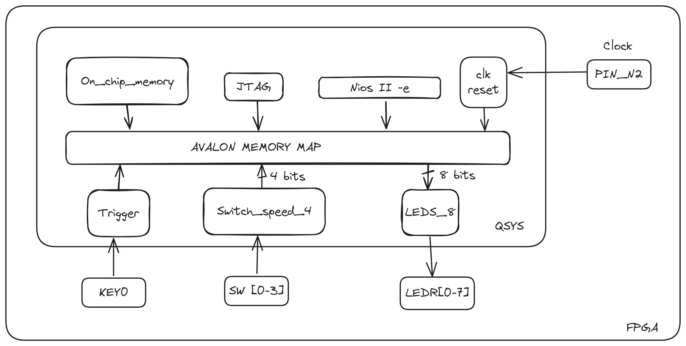
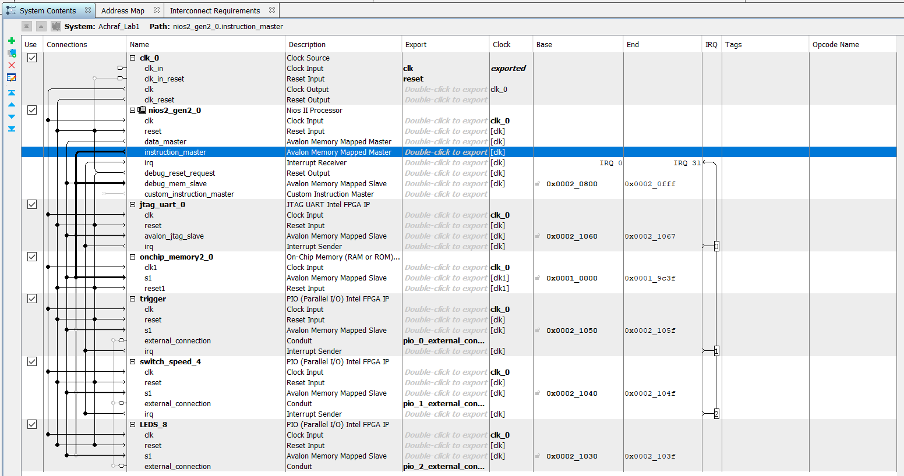

# LED Chaser
# I - Introduction:
Le but de ce lab est de concevoir et réaliser un LED Chaser en mettant en pratique les principes de la conception conjointe vus au cours. Les deux mécanismes (interruption et polling) ont été utilisés afin de répondre au cahier des charges.

**Interruption:** le bouton Trigger envoi une interruption afin de déclencher le LED Chaser.

**Polling:** la survéillance du registre DATA des 4 switchs par polling permet de controller la vitesse en utilisant 16 états.

# II - L'architecture du système:
#### 1 - Architecture du design:

Les blocs IP utilisés (voir schéma au-dessus) sont les suivants:
- **NIOS II Core:** un softcore d'architecture Harvard et de jeu d'instruction réduit (RISC 32 bits) en mode economy.
- **Memoire RAM:** 40 ko.
- **JTAG UART:** permettant le débogage.
- **Clock:** 50 MHz.
- **Trigger[PIO: 1bit]:** entrée (KEY0) qui permet d'effectuer *une lancée* de Chenillard avec interruption d'une priorité de IRQ1.
- **Switch_speed_4[PIO: 4bits]**: une entrée de 4 bits (boutons de switchs) pour fixer la vitesse.
- **LEDS_8[PIO: 8bits]**: sortie de 8 bits (LEDS).

#### 2 - Fichier QSYS:

Après la génération des blocs IP nécessaires pour cette architecture et dans le but de gérer les événements en utilisant les interruptions, deux niveaux d'IRQ ont été générés : IRQ1 (niveau 1) pour le PIO du Trigger  et IRQ2 (niveau 2) pour le commutateur de vitesse PIO (switch_speed_4).

# III - Progrès:
#### 1 - Platform Designer :
Sur Platform Designer, les étapes suivantes ont été effectuées dans leur ordre :
-   Câblage des composants comme montré dans la figure ci-dessus.
-   Définition du Reset/Exception de la mémoire dans l'IP du softcore.
-   Désactivation de l'initialisation de la mémoire.
-   Attribution des adresses à la mémoire.
-   Génération du système en QSYS.

#### 2 - Quartus :
Dans cette partie, le squelette du code VHDL offert par Plateform Designer (pour l'instanciation) a été implémenté et câblé. Ensuite, pour des raisons de clarification des assignations de broches d'autres ports supplémentaires ont été ajoutés dans l'entité Lab1 (voir *TAIBI_Lab1.vhd*). La programmation sur la carte a été effectuée après les étapes suivantes :

-   Assignation des broches.
-   Choix de *Achraf_Lab1.qsys* comme Top Level Entity.
-   Compilation.
-   Programmation sur la carte (*TAIBI_Lab1.sof*).

#### 3 - Nios2 Command Shell :
Comme vu en cours, il est indispensable de générer le BSP/HAL, puis de créer un Makefile pour le programme logiciel que nous utilisons ensuite pour la programmation du LED Chaser.
> Remarque: Pour cette étape j'ai utilisé les commandes shell su cours.

#### 4 - Program C :
Ma stratégie pour effectuer ce TP a été réparties par plusieurs étape, pour passer d'une étape à l'autre j'ai effectué des tests de validation. Consultez les commits pour revenir à une étape précise. 

**Étape 0 :** Programmation d'un programme Hello world exécuté sur CPU, j'ai utilisé *alt_printf()*.

**Validation 0:** L'Intéraction entre les blocs IP : Nios2, JTAG, RAM.

**Étape 1 :** Création d'un LED Chaser sans contrôle de vitesse. Pour cela, j'ai créé deux fonctions. La première est une fonction ISR (*handle_interrupts()*) qui gère l'interruption. Dans cette fonction, nous enregistrons d'abord la valeur du registre edge_capture dans un pointeur, puis nous mettons le bit numéro 0 du registre edge_capture à 1 pour le réinitialiser (arrêt de l'interruption). J'ai implémenté une boucle for qui met un 1 dans l'une des sorties du PIO LEDS_8, puis effectue une pause (*usleep*), et enfin décale le 1 d'un pas à gauche (voir *main.c*). La deuxième fonction (*init_interrupt_pio()*) sert à initialiser l'interruption. Dans cette fonction, on trouve :
-   Activation d'une seule entrée d'interruption en écrivant 1 à l'emplacement correspondant des bits de masque d'interruption. Le macro utilisé est IOWR_ALTERA_AVALON_PIO_IRQ_MASK(base, data) défini dans le fichier *altera_avalon_pio_regs.h*.
-   Réinitialisation du registre edge_capture.
-   Enregistrement de l'ISR handle_interrupts() à l'aide de la fonction vue en cours *alt_irq_register(alt_u32 id, void context, void (isr)(void, alt_u32))*.

**Validation 1 :** Processus de l'interruption. À chaque fois que l'on appuie sur le trigger, on observe le lancement du LED Chaser.

**Étape 2 :** Ajout du contrôle de la vitesse. Quatre interrupteurs sont utilisés. Le mécanisme utilisé est le polling. À l'aide d'une variable intermédiaire de type *char*, on récupère les valeurs des 4 interrupteurs (on a 16 états) et on multiplie cette valeur par la variable speed dans la fonction ISR *handle_interrupts()*.

**Validation 2 :** Le changement de la vitesse est effectué. Cependant, la vitesse ne se met pas à jour pendant le défilement du LED Chaser. Il faut attendre que celui-ci se termine pour régénérer un autre avec une autre vitesse (voir vidéo).

**Étape 3 :** Refactoring du code
#### 5 - Problèmes rencontrés :
Comme montré dans le QSYS ci-dessus, l'objectif de générer une IRQ par les switchs était de ne pas utiliser le polling. Cependant, l'utilisation de plusieurs interruptions (switchs + Trigger) a provoqué des erreurs dans mon code. Étant donné que j'ai perdu beaucoup de temps à essayer d'utiliser uniquement les interruptions, j'ai choisi d'utiliser le polling et de passer au LAB2.

# IV - Résultats:
La video ci-dessous montre une démonstration du LED Chaser:

# V - Conclusion:
En partant de la conception jusqu'à la réalisation de ce TP, je me suis familiariser avec la conception conjointe.Par conséquent gérer un softcore de type NIOS2 n'est plus une boite noire.Dans le coté embarqué l'utilisation d'un type usuel comme *int* peut causer des problèmes du Memory Overflow surtout dans ce cas ou on avait une mémoire RAM de 40 KO.
